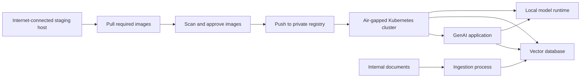

# Air-Gapped GenAI Pattern (2025)

## About this repo

This is a minimal reference implementation demonstrating an air-gapped Generative AI pattern for restricted enterprise and banking environments.

It is intentionally scoped to show the core deployment pattern, not a production system.

The goal is to demonstrate how GenAI components can be prepared for environments where Kubernetes worker nodes do not have direct internet access and dependencies must be mirrored through a controlled registry.

## What this demonstrates

* Private container registry pattern for restricted environments
* Image mirroring workflow for offline or semi-offline deployments
* Separation between internet-connected staging systems and isolated runtime clusters
* Basic documentation pattern for regulated infrastructure
* Foundation for future RAG, local LLM, vector database, and observability components

## Architecture pattern



## Example flow

1. Identify required images and versions.
2. Pull images on a controlled staging host.
3. Scan and approve images.
4. Push approved images to a private registry.
5. Deploy workloads using only private registry image references.
6. Keep runtime cluster nodes blocked from direct internet access.

## Repository layout

```text
airgapped-genai-pattern-2025/
  docs/
    architecture.md
  scripts/
    registry_mirror.sh
  image-list.txt
  README.md
```

## Current status

* Initial folder structure created
* Air-gapped pattern documented
* Example image list added
* Registry mirror script placeholder added

## Roadmap

* [ ] Add tested image mirroring workflow
* [ ] Add Harbor registry example
* [ ] Add Kubernetes deployment example
* [ ] Add policy examples for restricted egress
* [ ] Add SBOM and image scanning notes
* [ ] Add RAG deployment pattern using local embeddings and vector database

## Important note

This repository does not contain confidential enterprise configuration, real IP addresses, hostnames, customer data, or production banking diagrams.

It is a public, sanitized reference pattern designed to demonstrate architectural thinking.

