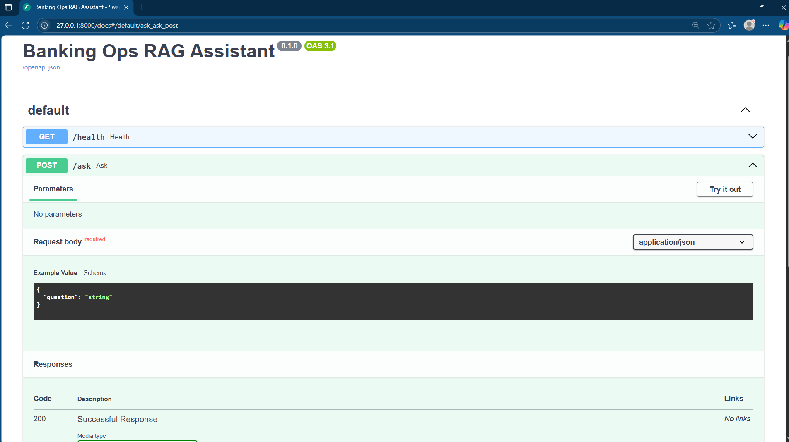

# Banking Ops RAG Assistant (2025)

## About this repo

This is a minimal reference implementation demonstrating Retrieval-Augmented Generation (RAG) assisted operations in an air-gapped banking environment.

It is intentionally scoped to show a FastAPI-based RAG API pattern with basic guardrails, not a production system.

The goal is to demonstrate:
- API-first assistant design using FastAPI
- A simple `/ask` endpoint for operational questions
- Basic guardrail logic for risky banking prompts
- A foundation for future document retrieval from banking procedures, runbooks, or standard operating procedures

Status: working FastAPI with /health and /ask.

How to run:

1) python -m venv .venv
2) .\.venv\Scripts\Activate.ps1
3) pip install -r requirements.txt
4) python -m uvicorn app.main:app --reload
Docs: http://127.0.0.1:8000/docs
