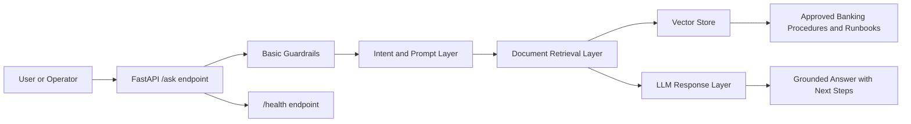

# Banking Ops RAG Assistant (2025)

## About this repo

This is a minimal public reference implementation of a Banking Operations Retrieval-Augmented Generation (RAG) assistant.

It demonstrates how an API-first assistant can answer operational questions from controlled internal knowledge sources such as procedures, runbooks, standard operating procedures, and support documentation.

This is not a production banking system. It does not contain confidential data, real customer information, production architecture, private IP addresses, hostnames, or internal banking documents.

## Problem

In regulated banking and enterprise environments, operations teams often rely on scattered documentation, manual knowledge lookup, and repeated escalation for routine questions.

Typical examples include:

* How should a branch operations issue be handled?
* Which standard operating procedure applies to a specific request?
* What are the first troubleshooting steps before escalation?
* Which runbook should be followed for a known operational scenario?

Manual lookup creates delays, inconsistent answers, and unnecessary escalation.

This project demonstrates a compact pattern for turning approved operational documentation into an API-accessible assistant.

## Architecture



## Current implementation

Current version includes:

* FastAPI application
* `/health` endpoint
* `/ask` endpoint
* Basic deny-list guardrail logic
* Stubbed RAG response function
* Swagger UI documentation screenshot

The current `/ask` endpoint proves the API pattern works. Retrieval and real document indexing are planned next.

## Why these decisions?

### Why FastAPI?

FastAPI was chosen because it is lightweight, easy to test, and suitable for building API-first internal tools. It also provides automatic Swagger documentation, which makes the demo easy to validate.

### Why RAG?

Retrieval-Augmented Generation (RAG) is the right pattern when answers must be grounded in approved internal documents instead of relying only on model memory.

For regulated environments, this is important because the assistant should answer from controlled sources such as procedures, policies, and runbooks.

### Why basic guardrails?

Banking environments require caution around risky prompts. This demo includes a simple guardrail layer to show where prompt filtering and safety controls would be applied.

The current guardrail implementation is intentionally simple and should be replaced with stronger policy-based controls in a production design.

### Why not include real banking data?

This is a public repository. Real operational documents, banking procedures, customer information, hostnames, private IP addresses, and production architecture must not be exposed.

The repo uses a sanitized public pattern only.

## Difference from OpsArc Incident Copilot

This project is focused on banking operations knowledge retrieval.

OpsArc Incident Copilot is a separate infrastructure incident triage concept focused on observability alerts, vROps data, probable cause analysis, severity classification, and runbook generation.

In short:

* Banking Ops RAG Assistant = procedure and knowledge assistant
* OpsArc Incident Copilot = infrastructure incident triage assistant

They share similar GenAI patterns, but they solve different problems.

## What did not work yet / known gaps

This is still an early reference implementation.

Current gaps:

* No real document ingestion yet
* No vector database integration yet
* No source citation in answers yet
* No authentication or role-based access control
* No audit logging
* No production-grade prompt safety layer
* No offline model runtime integration yet

These gaps are intentional for the first version. The repo is scoped to show the API and architecture pattern first.

## Planned next steps

* [ ] Add sample sanitized runbook documents
* [ ] Add document chunking
* [ ] Add local vector search
* [ ] Add source references in answers
* [ ] Add better guardrail handling
* [ ] Add offline/local model option
* [ ] Add architecture decision record for FastAPI + RAG pattern

## Results / success criteria

This demo is not claiming production results.

For a real implementation, success would be measured by:

* Reduced time spent searching procedures
* Fewer repeated escalations for known issues
* More consistent answers from approved documentation
* Better traceability through source-linked responses
* Safer use of GenAI in restricted environments

## Screenshot


## Run locally

```powershell
python -m venv .venv
.\.venv\Scripts\Activate.ps1
pip install -r requirements.txt
python -m uvicorn app.main:app --reload
```

Open:

```text
http://127.0.0.1:8000/docs
```

## Example request

```json
{
  "question": "What are KYC steps?"
}
```

## Important note

This repository is intentionally compact. It is designed to demonstrate architecture thinking, API structure, and safe public documentation practices.

It is not a production banking assistant.
